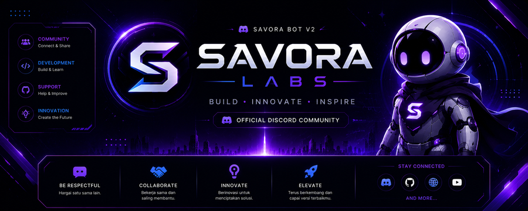

<p align="center">
  
</p>

<p align="center">
  
</p>

<h1 align="center">Savora v3</h1>

<p align="center">
  Aplikasi pencatat tabungan &amp; keuangan pribadi — dibangun dengan <strong>React (JSX) + Vite</strong>.
</p>

## ✨ Fitur

- 🔐 Register & Login (session tersimpan lokal di browser)
- 🏠 Dashboard — sapaan real-time & ringkasan saldo
- 💸 Transaksi — catat pemasukan, pengeluaran, tabungan
- 🐷 Tabungan — fokus pantau semua setoran tabunganmu
- 🎯 Target Tabungan — dengan progress bar otomatis
- 📊 Anggaran — batasi pengeluaran per kategori
- 📈 Analitik — statistik keuangan & insight sederhana
- ⚙️ Settings — profil, ganti password, dark/light mode, notifikasi,
  mata uang, bahasa, export/import data, hapus akun, logout
- 🛡️ Admin Panel — khusus akun admin (`gtau22609@gmail.com`):
  statistik aplikasi, kelola pengumuman banner, hapus semua data
- 📱 Responsive — nyaman di HP maupun desktop
- ⚡ PWA — bisa di-install ke homescreen & jalan offline

## 🛠️ Tech Stack

- ⚛️ React 18
- ⚡ Vite
- 🧭 React Router (HashRouter)
- Vanilla CSS (dark/light theme via CSS variables)

## 📂 Struktur

```
savora-v3/
├── public/
│   ├── icon-192.png      # icon PWA
│   ├── icon-512.png      # icon PWA + logo README
│   ├── apple-touch-icon.png
│   ├── banner.png         # banner README
│   ├── manifest.json
│   └── sw.js
├── src/
│   ├── pages/          # Landing, Login, Register, Home, Transactions,
│   │                     Savings, Goals, Budget, Analytics, Settings, Admin
│   ├── components/      # ProfileCard, MenuGrid, PageHeader, dll
│   ├── AuthContext.jsx  # register/login/logout/session
│   ├── ThemeContext.jsx # dark/light mode
│   ├── storage.js       # data transaksi & target (localStorage)
│   ├── App.jsx           # routing
│   ├── main.jsx
│   └── index.css
├── index.html
├── package.json
└── vite.config.js
```

## 🚀 Instalasi & Menjalankan

```bash
npm install
npm run dev
```

Buka `http://localhost:5173`.

## 📦 Build Produksi

```bash
npm run build
npm run preview
```

## 📝 Catatan

- Data disimpan lokal di browser (`localStorage`) — belum terhubung ke server/database.
- Fitur AI Assistant sebelumnya **sudah dihapus** dan digantikan fitur keuangan (Transaksi, Tabungan, Target, Anggaran, Analitik).
- Logo di atas (`icon-512.png`) dipakai sebagai **icon aplikasi saat Savora di-install lewat PWA** ke homescreen.
